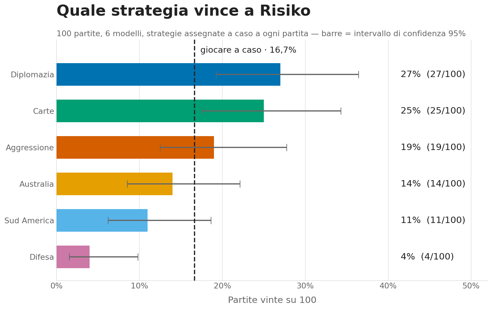
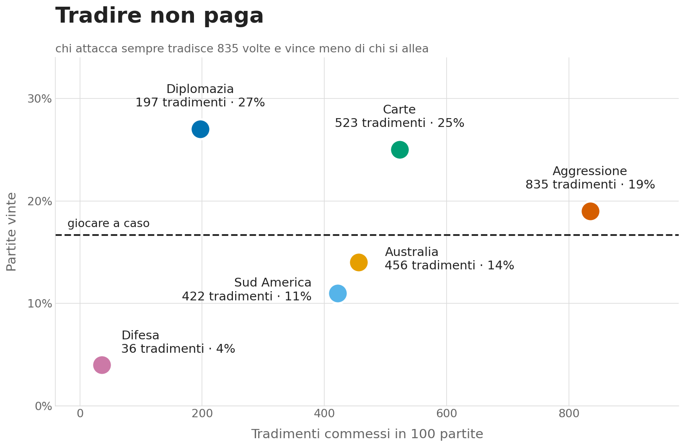
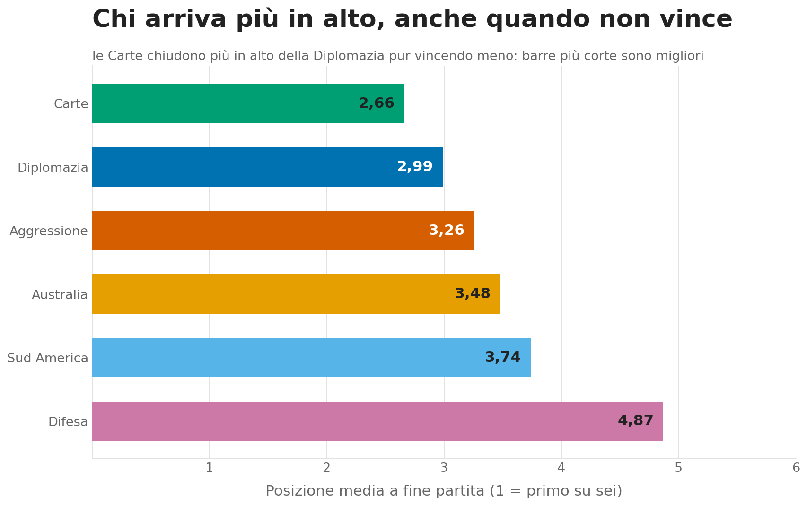
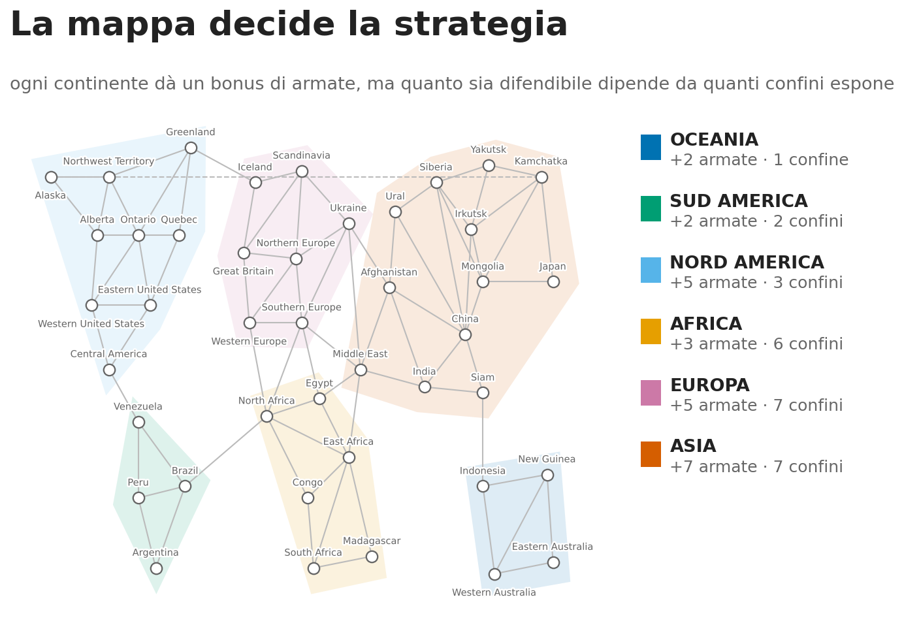
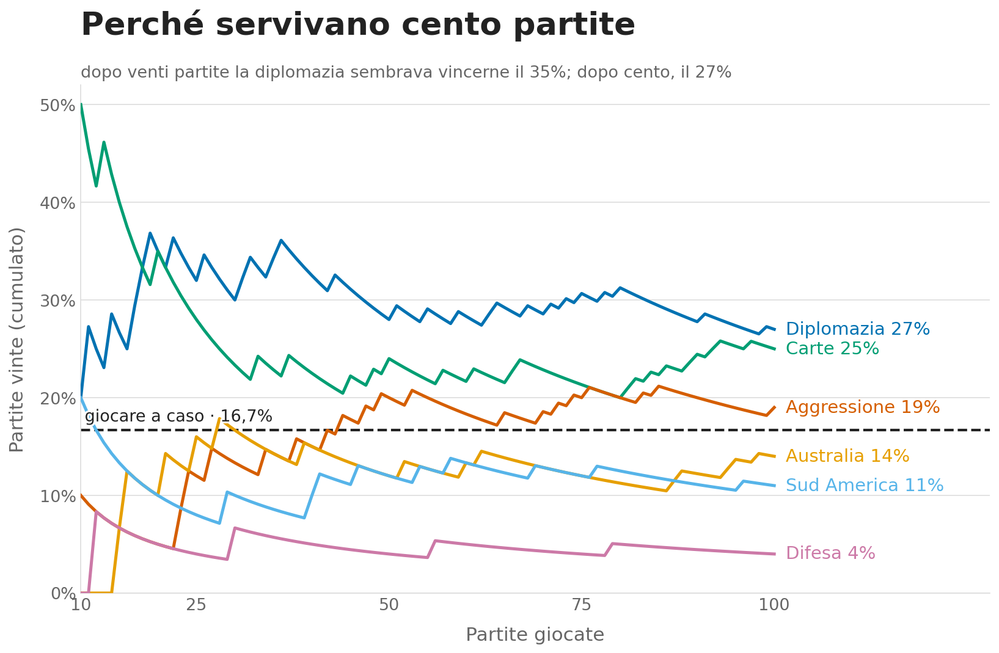
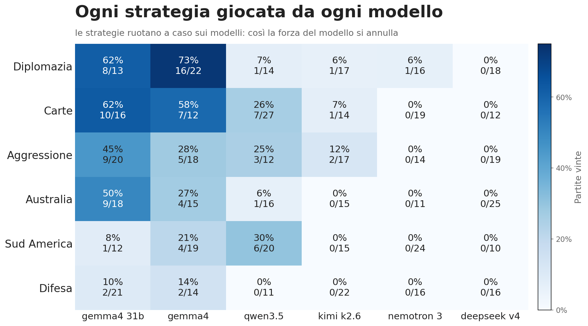
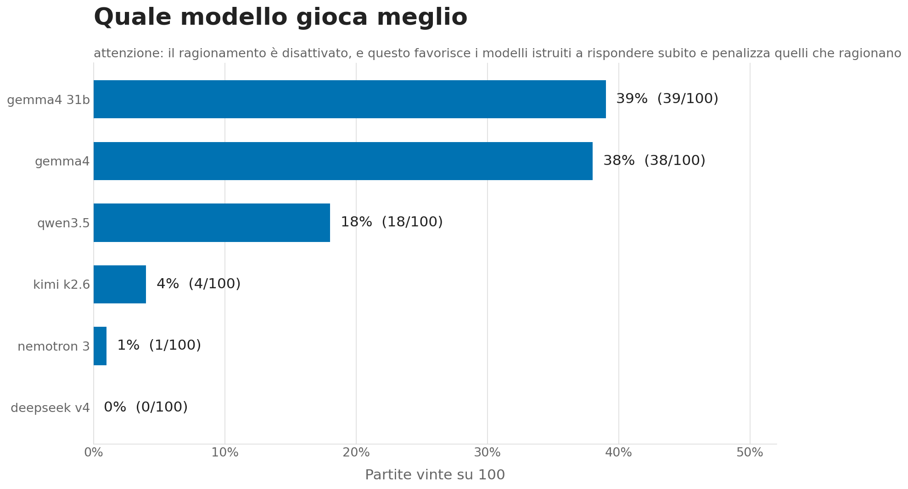
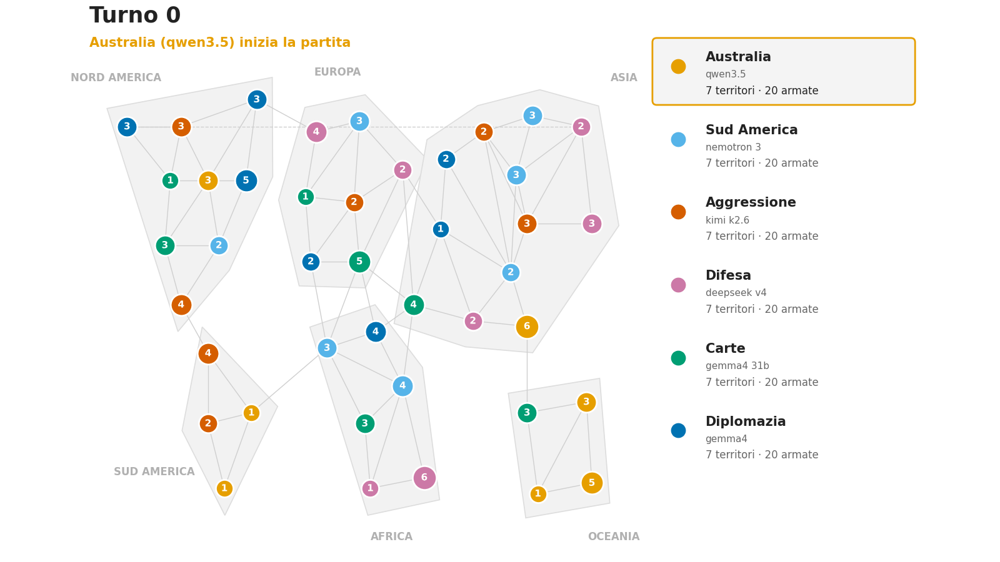

# risiko-rl

**Research question:** What is the best strategy to win at Risiko (Risk)?

This project trains a PPO agent to discover optimal Risiko strategy purely through self-play and games against an Ollama-served LLM opponent — run locally for free or against a hosted big model (e.g. `gpt-oss:120b`) on Ollama Cloud.

---

## Results — the 100-game LLM tournament

Six cloud LLMs played 100 six-player games with diplomacy (alliances, coalitions, betrayal). Six strategies were **reassigned at random to the models in every game**, so a strategy's win rate measures the strategy, not the model that happened to draw it.

> The figures are labelled in Italian — they were built for a video. The code and the API are English.

### Which strategy wins



| Strategy | Win rate | 95% CI (Wilson) | Mean placement | Betrayals |
|---|---|---|---|---|
| Diplomacy — ally, then gang up on the leader | **27%** | 19–36% | 2.99 | 197 |
| Card cycle — one conquest per turn, trade sets | **25%** | 17–34% | **2.66** | 523 |
| Aggressive blitz | 19% | 13–28% | 3.26 | **835** |
| Australia lock | 14% | 9–22% | 3.48 | 456 |
| South America lock | 11% | 6–19% | 3.74 | 422 |
| Turtle / defensive | 4% | 2–10% | 4.87 | 36 |

Random play in a six-player game wins **16.7%**. Three results survive the confidence intervals:

- **Turtling loses to the coin flip.** Fortify and wait, and you win 4% — a quarter of what you'd get by moving at random.
- **Diplomacy and the card cycle are tied at the top**, and their intervals overlap heavily. There is no single winner in this data; there are two.
- **The Australia advice does not hold.** Sealing the continent with the single border — the most-repeated tip in every Risk guide — wins 14%: indistinguishable from playing at random.

### Betrayal does not pay



Aggressive blitz commits **835 betrayals** — four times the diplomat — and still finishes below it. A scatter, not a dual-axis chart: two measures on two scales would invent a relationship neither of them supports.

### Winning is not the same as surviving



The card cycle **finishes higher on average** (2.66) than diplomacy (2.99) while winning fewer games. Win rate alone would have hidden that.

### The map explains the temptation



Every continent trades an army bonus against the number of borders it exposes. Australia exposes exactly one — which is why everyone recommends it, and why it reads as a trap once the other five players can see you sitting in it.

### Why 100 games and not twenty



After twenty games diplomacy looked like a 35% strategy. After a hundred it is 27%. The lead changes hands more than once before it settles — a shorter run would have published a different answer.

### The control, and its caveat



Every strategy was played by every model, so a strategy cannot win merely by drawing the strongest model.

<details>
<summary>Model-vs-model win rates — published with a warning</summary>



**This comparison is not clean.** The tournament runs with reasoning disabled (`think=False`), which favours instruct-tuned models that answer immediately and cripples reasoning models that expect to deliberate. Read it as a sanity check on the matrix above, not as a model ranking.

</details>

### One game, in full



Every seat is named by the **strategy** it plays and wears that strategy's colour — the same hue it carries in every figure above. The panel on the right is the live standings, sorted by territories held, because "who is in front right now" is the thing the other five players are reacting to.

Two moments from the traced game, straight out of `visualization/game_trace_g0.json`:

**The coalition forms on turn zero.** Three of the six strategies — Defence, Cards, Diplomacy — independently declare war on the *same* player: Australia. Nobody told them to. They read the board and converged. Australia finished fifth of six.

**The betrayal, verbatim.** Kimi, playing Aggressive blitz, proposed an alliance to Australia, South America and Defence — and in the same JSON response listed its attack priorities as South America, Defence, Australia. The same three. It went on to win that game.

### Reproduce it

Every figure is rebuilt from the committed ledger — offline, no Ollama call, no quota:

```bash
make video-assets                          # → figures/, from results/tournament/tourney300/
python scripts/come_vincere_al_risiko.py   # the same figures, plus the Italian voice-over

# Rebuild the replay from the saved trace — seconds, no game replayed
python -m visualization.trace_game --from-trace visualization/game_trace_g0.json --gif figures/partita.gif
```

---

## Install

```bash
uv pip install -r requirements.txt
```

Python 3.12+ required. PyTorch and all dependencies are pinned in `requirements.txt`.

---

## Ollama setup

The LLM opponent calls **Ollama** via the OpenAI-compatible `/v1/chat/completions` endpoint with a `response_format` JSON schema (`strict: true`) that constrains the reply to `{"action_index": <int>}` — an index into the legal-action list, so the chosen move is legal by construction and the response is tiny.

One client serves both modes; they differ only in `base_url`, key, and model:

**Local (free, no key):** install [Ollama](https://ollama.com), pull a model, and you're done — no `.env` needed (the client defaults to `http://localhost:11434/v1`).

```bash
ollama pull gpt-oss:20b
```

**Cloud (Ollama Turbo, hosted big models like `gpt-oss:120b`):** copy the template and set your key:

```bash
cp .env.example .env
# then set OLLAMA_BASE_URL=https://ollama.com/v1 and OLLAMA_API_KEY=<your key>
```

`src/utils/env.py:ensure_env_loaded()` loads `.env` once per process (called by the CLI; lazily by the client). Auth uses the standard `Authorization: Bearer <key>` header. Local serving ignores the key, so any placeholder works.

---

## Environment variables (optional — only for cloud)

| Variable | Example | Purpose |
|---|---|---|
| `OLLAMA_BASE_URL` | `https://ollama.com/v1` (cloud) / `http://localhost:11434/v1` (local, default) | OpenAI-compatible base URL; the client appends `/chat/completions` |
| `OLLAMA_API_KEY` | `your-ollama-api-key` | Sent as `Authorization: Bearer <key>`; ignored by local serving |

`LLMOpponent` enforces a hard 30 s timeout per move via a `ThreadPoolExecutor` and falls back to a `RandomAgent` on any timeout, HTTP error, parse error, or out-of-range index — the returned action is always legal.

---

## Configuration

| File | Purpose |
|---|---|
| `config/default.yaml` | PPO hyperparameters, network shape, self-play settings, reward coefficients |
| `config/default_6p.yaml` | Per-player LLM sampling profiles for 6-player games |
| `config/llm_6p.yaml` | 6-player training: PPO learner vs 5 LLM opponents |

Key defaults in `config/default.yaml`:

```yaml
ppo:
  lr: 0.0003
  gamma: 0.99
  n_steps: 2048
  n_epochs: 10

self_play:
  n_players: 2
  promote_threshold: 0.55

reward:
  sparse_win: 1.0
  sparse_loss: -1.0
  dense_territory_delta: 0.01
  dense_continent_bonus_delta: 0.05
  dense_army_ratio: 0.005
```

---

## CLI

The CLI is installed as `risiko-rl` or run via `python -m risiko_rl.cli`.

| Command | Description |
|---|---|
| `pretrain` | Generate heuristic demo dataset + BC-pretrain the policy (warm-start) |
| `train` | Run self-play PPO training (auto-resumes from `<checkpoint-dir>/latest.pt`) |
| `evaluate` | Head-to-head evaluation between two agents |
| `watch` | Watch a single game rendered frame-by-frame |
| `benchmark` | Monte Carlo baselines (random vs random, random vs LLM) |
| `bc_eval` | Validate pretrained policy win-rate vs random with Wilson CIs (`training/bc_eval.py`) |

### `pretrain`

BC warm-start: generate a heuristic demonstration dataset then supervised-clone the policy into the existing `ActorCritic` weights. Uses the AlphaGo SL→RL pattern — one offline pretrain, PPO corrects drift online.

```bash
# Step 1 — generate demos + BC-pretrain (writes models/pretrained.pt)
risiko-rl pretrain --config config/bc_pretrain.yaml

# Step 2 — warm-start PPO: place the pretrained weights where train auto-resumes
cp models/pretrained.pt models/latest.pt
risiko-rl train --config config/random_6p_pretrain.yaml --checkpoint-dir models
```

> **No `--resume` flag.** `risiko-rl train` auto-resumes from `<checkpoint-dir>/latest.pt` whenever that file exists — there is no explicit `--resume` flag. The `cp` one-liner above is the only step needed to warm-start from a BC checkpoint.

Override any `BCConfig` field without editing YAML:

```bash
risiko-rl pretrain --config config/bc_pretrain.yaml --override bc.n_games=5000 --override bc.epochs=20
```

To validate the pretrained policy beats random before spending PPO time, run the win-rate gate directly:

```bash
python -m training.bc_eval
```

---

### `train`

```bash
# Train with default config
risiko-rl train

# Override any config field with dot notation
risiko-rl train --override ppo.lr=1e-4 --override ppo.gamma=0.97

# Resume from checkpoint, save to custom dir
risiko-rl train --config config/default.yaml --checkpoint-dir models/ --seed 0

# Set the Ollama model for all LLM opponents (pre-flight checked against the server)
risiko-rl train --config config/llm_6p.yaml --model glm-5.1:cloud
```

### `evaluate`

```bash
# Random agent vs LLM, 100 games
risiko-rl evaluate --agent-a random --agent-b llm --n-games 100

# PPO checkpoint vs LLM, export CSV
risiko-rl evaluate --agent-a models/best.pt --agent-b llm --n-games 200 --output results.csv
```

### `watch`

```bash
# Watch two random agents in ASCII mode
risiko-rl watch --agent1 random --agent2 random --mode ascii

# Save PIL animated GIF replay
risiko-rl watch --agent1 models/best.pt --agent2 random --output replay.gif
```

### `benchmark`

```bash
# Run baseline tournament (50 games per matchup)
risiko-rl benchmark --games 50

# Include RL checkpoint and export CSV
risiko-rl benchmark --games 100 --rl-checkpoint models/best.pt --output baselines.csv
```

---

## Tracing one LLM game

Replays a single tournament game and records everything: the exact prompt sent to each model, the raw response, the model's `thinking` trace when it emits one, the parsed move, and a board snapshot after every env step.

```bash
# Cheap sample — 20 player-turns
python -m visualization.trace_game --max-turns 20

# Full game, with the models' reasoning, replayed into a GIF
python -m visualization.trace_game --think --gif figures/partita.gif

# Redraw the replay from a trace already on disk — offline, seconds, no quota
python -m visualization.trace_game --from-trace visualization/game_trace_g0.json --gif figures/partita.gif
```

The trace is flushed to disk every 60s while the game runs (marked `"partial": true` until it finishes), so a crash never throws away the LLM calls it already paid for. Here is a model deliberating, straight out of the JSON:

> *"I am Player 0. Phase: REINFORCE. Strategy: Secure Australia first (take all 4 territories), then expand north through Indonesia. Defend the single northern chokepoint (Indonesia) aggressively."*
> — `qwen3.5:cloud`, 51s of deliberation, before picking its reinforcement

The JSON lands in `visualization/game_trace_g<index>.json` (or `--out`). This calls Ollama and **consumes quota** — `--think` multiplies both latency and cost, which is why the tournament itself runs with it off.

---

## TensorBoard

```bash
tensorboard --logdir results/runs/
```

Logged per episode: `episode/reward`, `episode/win`, `episode/win_rate_100`, `episode/length`, `episode/card_trade_frequency`, `episode/mean_territory`, `continent/*`, `train/policy_loss`, `train/value_loss`, `train/entropy_loss`.

---

## Baselines

Win rates at 6 players (random baseline ≈ 1/6 ≈ 16.7%):

| Agent | Win rate | Notes |
|---|---|---|
| Random | ≈ 16% | Uniform action sampling |
| LLM (gpt-oss) | ≈ 25–35% | Zero-shot tactical reasoning |
| PPO (target) | > 35% | Self-play + LLM curriculum |

---

## Six-player LLM profiles

Defined in `config/default_6p.yaml`. Each slot defaults to `gemma4:12b-mlx` (local, free) with a distinct `temperature`/`top_p` and a strategy hint injected into the prompt. Override the model **per slot** via the `model` field, or **uniformly for all slots** at launch with `risiko-rl train --model <name>` (e.g. `--model glm-5.1:cloud`). The requested model is pre-flight checked against the Ollama server's model list, so a typo fails fast instead of silently degrading every opponent to random.

| Player | Temp | Top-p | Strategy hint |
|---|---|---|---|
| 0 | 0.1 | 0.90 | Play greedily: maximise territory gain each turn. |
| 1 | 0.4 | 0.90 | Focus on securing full continents before expanding. |
| 2 | 0.7 | 0.85 | Eliminate the weakest player early; control cards. |
| 3 | 0.3 | 0.95 | Fortify borders and expand only when safe. |
| 4 | 0.9 | 0.80 | Play unpredictably; avoid predictable attack patterns. |
| 5 | 0.5 | 0.90 | Balance attack and defence; trade cards conservatively. |

---

## References

- [RULES.md](RULES.md) — full Risiko rule set used by the environment
- [CLAUDE.md](CLAUDE.md) — architecture overview and coding conventions
